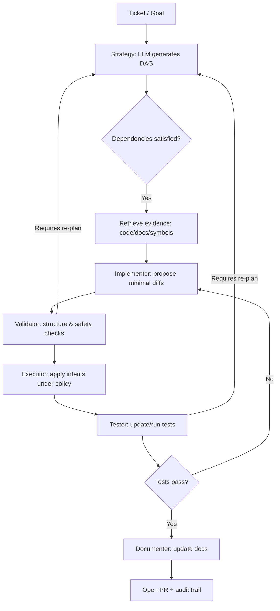
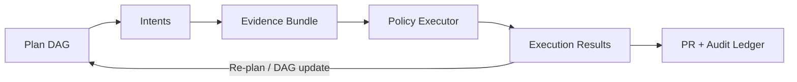

## Agent Flow — Project Summary (One‑Pager)

### Overview
- Problem: Chat‑centric agents conflate reasoning and execution, leading to unsafe operations, context bloat, and weak auditability.
- Approach: Document‑aware, DAG‑driven orchestration where LLMs plan and produce structured intents; a separate executor performs validated actions.

### Core principles (2025)
- **Separation of concerns**: LLMs generate plans and intents; executors act under policy.
- **Minimal context**: Each step runs with just‑enough inputs and doc snippets.
- **Auditability**: DAG, intents, validations, and effects are replayable and logged.
- **Documentation‑first**: Structured docs (APIs, types, examples) ground reasoning.
- **Safety**: Validation gates (schema, semantics, dependencies, resources, risk).

### Models and chats
- Multiple LLM models are used across the process (different roles may use different models/providers).
- Multiple chats are initialized and tracked: each DAG node (and role) has its own chat with an ID and recorded model/version.
- Chats contain only minimal, role‑specific prompts and inputs; no tool execution occurs in chats—only intent outputs.
- All chats are persisted with their inputs/outputs for provenance and replay.

### Workflow overview

### Artifact flow

### Roles
- Planner: Produces the DAG (nodes, dependencies, expected outputs, confidence).
- Decomposer: Defines atomic steps, inputs/outputs, and allowed intents.
- Implementer: Proposes minimal diffs aligned to evidence.
- Validator: Enforces schema, safety policy, dependency/resource checks.
- Executor: Applies approved intents; records diffs, logs, and rollbacks.
- Tester: Generates/updates tests; routes failures back into the plan.
- Documenter: Updates README/API docs according to final changes.

### Properties
- PR‑oriented outputs: Branch and PR with plan, diffs, tests, and doc updates.
- Controlled execution: Models do not invoke tools; execution is allow‑listed and logged.
- Inspectable artifacts: Plans and intents are persisted for review and replay.
- Token discipline: Minimal, targeted context per node.

### Careful context management
- Each chat gets only the necessary prior outputs and targeted documentation for its task; no global conversation history is carried over.
- Evidence is referenced explicitly (file, range, doc anchor); large inputs are summarized with links to sources.
- Token budgets per role/node are enforced; when exceeded, the system narrows or replans rather than expanding context.
- A context registry records every included item (IDs, hashes) to enable exact replay.

### Key interfaces (conceptual)
- **DAG IR**: nodes, edges, inputs, expected_outputs, metadata.
- **Intent**: operation, parameters, constraints, safety annotations.
- **Validation Result**: checks_passed/failed, severity, suggested_fixes.
- **Execution Feedback**: status, outputs, errors, performance, side_effects.

### Execution flow (concise)
- Ticket/goal is ingested; a DAG plan is produced.
- For each ready node, evidence is retrieved; minimal diffs are proposed.
- Validator checks structure/safety; executor applies approved intents in a branch.
- Tests run; failures loop back; successes advance; documentation updates are produced.
- A PR aggregates plan, diffs, tests, docs, and audit trail.

### Example: Multi-model orchestration
**User request**: "add feature a"

**Generated DAG**:
1. analyze repo
2. gather documentation  
3. identify solution
4. process solution
5. check for compliance
6. update any missed requirements
7. check for compliance
8. final verify

**Chat orchestration**:
- **Model 1** (Planner): Receives "add feature a" → generates DAG structure
- **Model 2** (Analyzer): Receives repo context → analyzes codebase structure
- **Model 3** (Documenter): Receives analysis results → gathers relevant docs
- **Model 4** (Solver): Receives docs + analysis → identifies solution approach
- **Model 5** (Processor): Receives solution → processes implementation details
- **Model 6** (Checker): Receives implementation → checks compliance rules
- **Model 7** (Updater): Receives compliance gaps → updates requirements
- **Model 8** (Verifier): Receives updated solution → final compliance check

Each model chat instance has a limited role. The system generates specialized prompts for each checker based on previous steps, creating an iterative refinement loop where multiple model calls progressively refine the solution until all validation gates pass. This multi-model orchestration with role-specific prompts is what makes the system unique.
