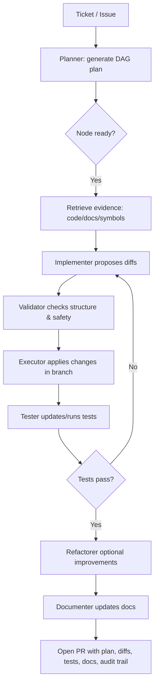
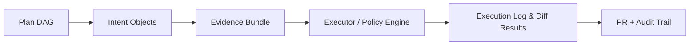
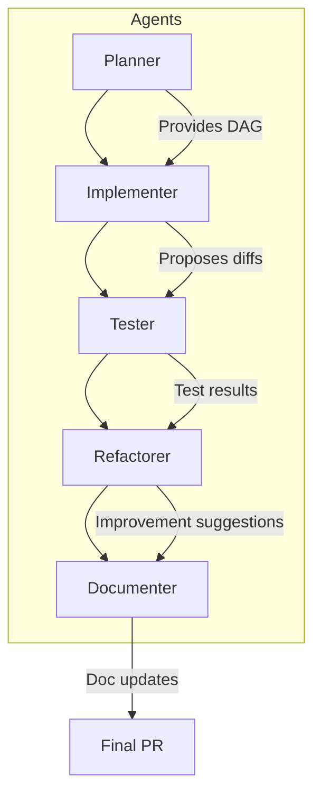

# Multi-Agent Coding That Actually Ships

## Core Problem

Developers need an AI teammate that **coordinates multiple specialized agents** (planner, implementer, tester, refactorer, documenter) through a **structured workflow** to deliver real code changes — safely, reliably, and efficiently.

Existing tools fail because they either:

* Chat endlessly without a concrete plan
* Hallucinate APIs or code
* Execute risky actions without guardrails

### Current Pain Points

* **Fragile progress:** Chat-first tools lack a shared plan and are hard to resume.
* **Limited depth:** Single-agent assistants may refactor without tests or propose fixes without understanding context.
* **Context thrash:** Too much irrelevant code/docs in prompts; not enough precise snippets.
* **Unsafe actions:** Writing files or running commands without review or policy enforcement.

### What We Actually Need

* **Structured workflow:** Agents assigned to stages (`plan ➞ implement ➞ test ➞ review ➞ document`) with handoffs and checkpoints.
* **Targeted context:** Each agent gets just the right files, docs, and diffs.
* **Structured outputs:** Plans, diffs, and test results are reviewable, replayable, and CI-friendly.
* **Safe execution:** Changes applied only through a policy-enforced executor; risky steps require approval.

### Success Criteria

* Given a ticket, the system produces a plan, generates diffs, updates docs, and ships a PR with passing tests — all with **review points and an auditable trail**.

---

# Solution: Multi-Agent Coding Workflow

A **developer-assist system** that coordinates specialized agents to produce structured outputs (diffs, tests, docs) behind guardrails. **Models never execute actions directly** — they produce intents that a policy-enforced executor applies. The **plan DAG** is the source of truth and every action is auditable.

## Agent Roles

* **Planner:** Converts tickets into a DAG of nodes, dependencies, and expected outputs.
* **Implementer:** Proposes minimal diffs per node with precise file and line context.
* **Tester:** Generates/updates tests, runs suites, and summarizes results.
* **Refactorer:** Suggests structure improvements without behavioral changes; scoped, safe diffs.
* **Documenter:** Updates README, CHANGELOG, and API docs based on code changes.

## Core Artifacts

* **Plan IR (DAG):** Nodes, edges, inputs, expected outputs, review gates.
* **Intent Objects:** Structured proposals (e.g., `file_change`, `test_run`) with parameters.
* **Evidence Bundle:** Relevant docs, code slices, or references used by an agent.
* **Execution Log:** Applied actions, results, diffs, and test outputs.

## Guardrails & Policy

* **Intent-only:** Agents produce intents; executor applies them.
* **Allow-lists:** Approved operations, tools, paths; out-of-scope actions blocked.
* **Dry-run & approvals:** Risky changes require preview and human approval.
* **Rollback/compensation:** Backup + revert plan for state-changing steps.

## Context Strategy

* Minimal, targeted input per node (specific files, hunks, symbols, docs).
* Structure-aware documentation parsing (OpenAPI, TypeDoc, DocFX) with references embedded in plans.
* Each agent receives only the evidence relevant to its node — no chat sprawl.

---

## Workflow (Happy Path)

---

## Artifact Flow

---

## Agent Interaction Overview

---

## Metrics / Definition of Done

* Plan fidelity vs reviewer baseline
* Test pass rate, coverage delta, flake rate
* Review time to merge; revision count
* Token and latency per merged PR
* Safety incidents prevented (blocked intents, dry-runs)

## Risks & Mitigations

* **Incorrect diffs:** Minimal, context-aware diffs; dry-run + tests required
* **Doc drift:** Auto-link references; enforce doc update nodes for API changes
* **Long-tail failures:** Checkpointing, re-planning subgraphs, compensation, actionable summaries

## Why This Works

Developers get a **predictable pipeline**: small, vetted steps with measurable quality gates and traceable outcomes. The result is **faster PRs, fewer surprises, and safer automation**.
